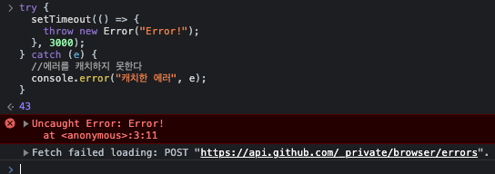

# 44장 REST API

### Q1. REST는 무엇인가요?

<details>
<summary>정답</summary>

- HTTP를 기반으로 클라이언트가 서버의 리소스에 접근하는 방식을 규정한 아키텍처입니다.

</details>

<br/>

### Q2. REST API는 무엇인가요?

<details>
<summary>정답</summary>

- REST를 기반으로 서비스 API를 구현한 것을 말합니다.

</details>

<br/>

### Q3. REST API의 구성 요소에는 무엇이 있나요?

<details>
<summary>정답</summary>

- 자원 resource : URI (엔드포인트)
- 행위 verb : HTTP 요청 메서드 (자원에 대한 행위)
- 표현 representations : 페이로드 (자원에 대한 행위의 구체적 내용)

</details>

<br/>

### Q4. REST API의 설계 원칙 두 가지를 말해주세요.

<details>
<summary>정답</summary>

- URI는 리소스를 표현해야 합니다.
  - URI는 리소스를 표현하는 데 중점을 두어야 하며, 리소스를 식별할 수 있는 이름은 동사보다는 명사를 사용합니다.
- 리소스에 대한 행위는 HTTP 요청 메서드로 표현합니다.
  - HTTP 요청 메서드는 클라이언트가 서버에게 요청의 종류와 목적(리소스에 대한 행위)를 알리는 방법입니다.

</details>

<br/>

### Q5. PUT 요청과 PATCH 요청의 차이는 무엇인가요?

<details>
<summary>정답</summary>

- PUT은 특정 리소스 전체를 교체할 때 사용합니다.
- PATCH는 특정 리소스의 일부를 수정할 때 사용합니다.

</details>

<br/>

# 45장 프로미스

### Q6. (복습) 전통적인 콜백 패턴의 한계는 무엇인가요? == 프로미스가 도입된 이유는 무엇인가요?

<details>
<summary>정답</summary>

- 전통적인 콜백 패턴은
  - 콜백 헬로 인해 가독성이 나쁘고
  - 비동기 처리 중 발생한 에러의 처리가 곤란하며
  - 여러 개의 비동기 처리를 한번에 처리하는 데 한계가 있습니다.
- ES6에서는 비동기 처리를 위한 또 다른 패턴으로 프로미스를 도입해
  - 전통적인 콜백 패턴이 가진 단점을 보완하며
  - 비동기 처리 시점을 명확하게 표현할 수 있다는 장점이 있습니다.
  
</details>

<br/>

### Q7. 아래 코드가 실행되었을 때, 콘솔에는 어떤 값이 출력되는지 설명해주세요.

```js
let todos;

const get = (url) => {
  const xhr = new XMLHttpRequest();
  xhr.open("GET", url);
  xhr.send();

  xhr.onload = () => {
    if (xhr.status === 200) {
      // 서버의 응답을 상위 스코프의 변수에 할당한다.
      todos = JSON.parse(xhr.response);
    } else {
      console.error(`${xhr.status}${xhr.statusText}`);
    }
  };
};
// id가 1인 post를 취득
get("https://jsonplaceholder.typicode.com/posts/1");
console.log(todos); // 💡 여기
```

<details>
<summary>정답</summary>

<br/>

- undefined가 출력됩니다.
- xhr.onload 이벤트 핸들러 프로퍼티에 바인딩한 이벤트 핸들러는 `💡 여기`의 console.log가 종료한 이후에 호출됩니다. 따라서 이 시점에는 아직 todos에 값이 할당되기 이전이기 때문입니다.

```
# 실행 순서
  - 비동기 함수인 get 함수가 호출된다.
  - get 함수의 실행 컨텍스트 생성되고, 콜 스택에 푸시된다.
  - 함수의 코드가 실행되면서 xhr.onload 이벤트 핸들러 프로퍼티에 이벤트 핸들러가 바인딩된다.
  - get 함수가 종료된다.
  - get 함수의 실행 컨텍스트가 콜 스택에서 팝된다.

  - console.log가 호출된다.
  - console.log의 실행 컨텍스트가 생성되고, 콜 스택에 푸시된다.
  - (console.log가 호출되기 전에 load 이벤트가 발생하더라도 console.log보다 먼저 실행되지 않는다.)
  
  - 서버로부터 응답이 도착해 load 이벤트가 발생한다.
  - xhr.onload 핸들러에 바인딩한 이벤트 핸들러가 태스크 큐에 저장되어 대기한다.
  - 콜 스택이 비면 이벤트 루프에 의해 콜 스택으로 푸시되어 실행된다.

즉, xhr.onload 이벤트 핸들러가 실행되는 시점에는 콜 스택이 빈 상태여야 하므로 console.log는 이미 종료된 이후다.
```

</details>

<br/>

### Q8. 콜백 헬이란 무엇인가요? 어떤 상황에 발생하나요?

<details>
<summary>정답</summary>

<br/>

- 콜백 함수 호출이 중첩되어 복잡도가 높아지는 현상입니다.
- 콜백 함수를 통해 비동기 처리 결과에 대한 후속 처리를 수행하는 비동기 함수가 비동기 처리 결과를 가지고 또다시 비동기 함수를 호출하는 식으로 중첩될 때 발생합니다.

</details>

<br/>

### Q9. 아래 코드는 어떻게 동작할까요? + 이유

```js
try {
  setTimeout(() => {
    throw new Error("Error!");
  }, 3000);
} catch (e) {
  console.error("캐치한 에러", e);
}
```

<details>
<summary>정답</summary>

<br/>



- catch 코드 블록에서 캐치되지 않고, 3초 뒤 Error가 발생합니다.
- setTimeout은 비동기 함수이므로 콜백 함수가 호출되는 것을 기다리지 않고 즉시 종료되어 콜 스택에서 제거됩니다.
- 콜백 함수가 실행될 때 setTimeout 함수는 이미 콜 스택에서 제거된 상태입니다. 
  - 이것은 콜백 함수를 호출한 것이 setTimeout 함수가 아니라는 것을 의미합니다.
- (GPT 설명) try-catch 블록은 자신의 스코프 내에 있는 코드가 동기적으로 실행되고 나면 종료됩니다.
이는 비동기 작업과는 상관없이 동기적으로 실행되는 코드에만 해당됩니다. 비동기 함수가 try 블록 내부에서 호출되더라도, 그 함수의 작업이 완료되기를 기다리지 않고 try-catch 블록은 종료됩니다.

</details>

<br/>

### Q10. Promise 생성자 함수에서 비동기 처리는 어느 부분에서 수행하나요? (코드 상에서)

<details>
<summary>정답</summary>

<br/>

- Promise 생성자 함수가 인수로 전달받은 콜백 함수의 내부에서 비동기 처리를 수행합니다.
- 비동기 처리가 성공하면 비동기 처리 결과를 resolve 함수에 인수로 전달하면서 호출하고,
- 실패하면 에러를 reject 함수에 인수로 전달하면서 호출합니다.

</details>

<br/>

### Q11. Promise의 상태 정보 세가지를 설명해주세요.

<details>
<summary>정답</summary>

<br/>

- 생성된 직후의 프로미스는 기본적으로 pending 상태이며, 
- 이후 비동기 처리가 수행되면 비동기 처리 결과에 따라 성공한 경우 resolve 함수를 호출해 프로미스를 fulfilled 상태로 변경하고
- 실패할 경우 reject 함수를 호출해 rejected 상태로 변경합니다.

| 프로미스의 상태 정보 | 의미 | 상태 변경 조건 |
|-------|-------|-------|
| pending | 비동기 처리가 아직 수행되지 않은 상태  | 프로미스가 생성된 직후 기본 상태 |
| fulfilled | 비동기 처리가 수행된 상태 (성공) | resolve 함수 호출 |
| rejected | 비동기 처리가 수행된 상태 (실패) | reject 함수 호출 |

</details>

<br/>

### Q12. Promise의 후속 처리 메서드는 언제 실행되나요?

<details>
<summary>정답</summary>

<br/>

- 프로미스의 비동기 처리 상태가 변화하면 후속 처리 메서드에 인수로 전달한 콜백 함수가 선택적으로 호출됩니다.

</details>

<br/>

### Q13. Promise의 후속 처리 메서드에서는 프로미스의 처리 결과를 어떻게 받아오나요?

<details>
<summary>정답</summary>

<br/>

- 프로미스의 처리 결과는 후속 처리 메서드의 콜백 함수에 인수로 전달됩니다.

</details>

<br/>

### Q14. 프로미스 체이닝이 가능한 이유는?

<details>
<summary>정답</summary>

<br/>

- then, catch, finally와 같은 후속 처리 메서드가 언제나 프로미스를 반환하기 때문입니다.
- 후속 처리 메서드의 콜백 함수가 프로미스가 아닌 값을 반환하더라도, 그 값을 암묵적으로 resolve 또는 reject하여 프로미스를 생성해 반환합니다.

</details>

<br/>

### Q15. 프로미스도 여전히 콜백 패턴을 사용하고 있어 가독성이 좋지 않습니다. 해결 방안은?

<details>
<summary>정답</summary>

<br/>

- ES8에서 도입된 async/await를 통해 해결할 수 있습니다.

</details>

<br/>

### Q16. Promise.all은 무엇인가요?

<details>
<summary>정답</summary>

<br/>

- 여러 개의 비동기 처리를 모두 병렬 처리할 때 사용합니다.
- 프로미스를 요소로 갖는 배열 등의 이터러블을 인수로 전달받고,
- 전달받은 모든 프로미스가 모두 fulfilled 상태가 되면 모든 처리 결과를 배열에 저장해 새로운 프로미스를 반환합니다.

</details>

<br/>

### Q17. 아래 코드가 처리되는 데 소요되는 시간은?

```js
const requestData1 = () =>
  new Promise((resolve) => setTimeout(() => resolve(1), 3000));
const requestData2 = () =>
  new Promise((resolve) => setTimeout(() => resolve(2), 2000));
const requestData3 = () =>
  new Promise((resolve) => setTimeout(() => resolve(3), 1000));

Promise.all([requestData1(), requestData2(), requestData3()]);
then(console.Log) // [ 1, 2, 3 ]
  .catch(console.error);
```

<details>
<summary>정답</summary>

<br/>

- 3초보다 조금 더 소요됩니다.
- 가장 늦게 fulfilled 상태가 되는 프로미스의 처리 시간보다 조금 더 길게 소요됩니다.

</details>

<br/>

### Q18. 아래 코드의 로그가 출력되는 순서는?

```js
setTimeout(() => console.log(1), 0);
Promise.resolve()
  .then(() => console.log(2))
  .then(() => console.log(3));
```
<details>
<summary>정답</summary>

<br/>

- 2 3 1
- 프로미스의 후속 처리 메서드의 콜백 함수는 태스크 큐보다 우선순위가 높은 마이크로태스크 큐에 저장되기 때문입니다.

</details>

<br/>

### Q18. fetch 함수는 무엇인가요?

<details>
<summary>정답</summary>

<br/>

- HTTP 요청 전송 기능을 제공하는 클라이언트 사이드 Web API입니다.
- HTTP 응답을 나타내는 Response 객체를 래핑한 Promise 객체를 반환합니다.

</details>
